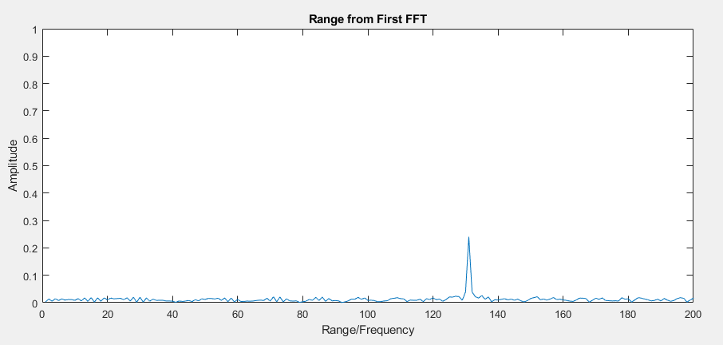
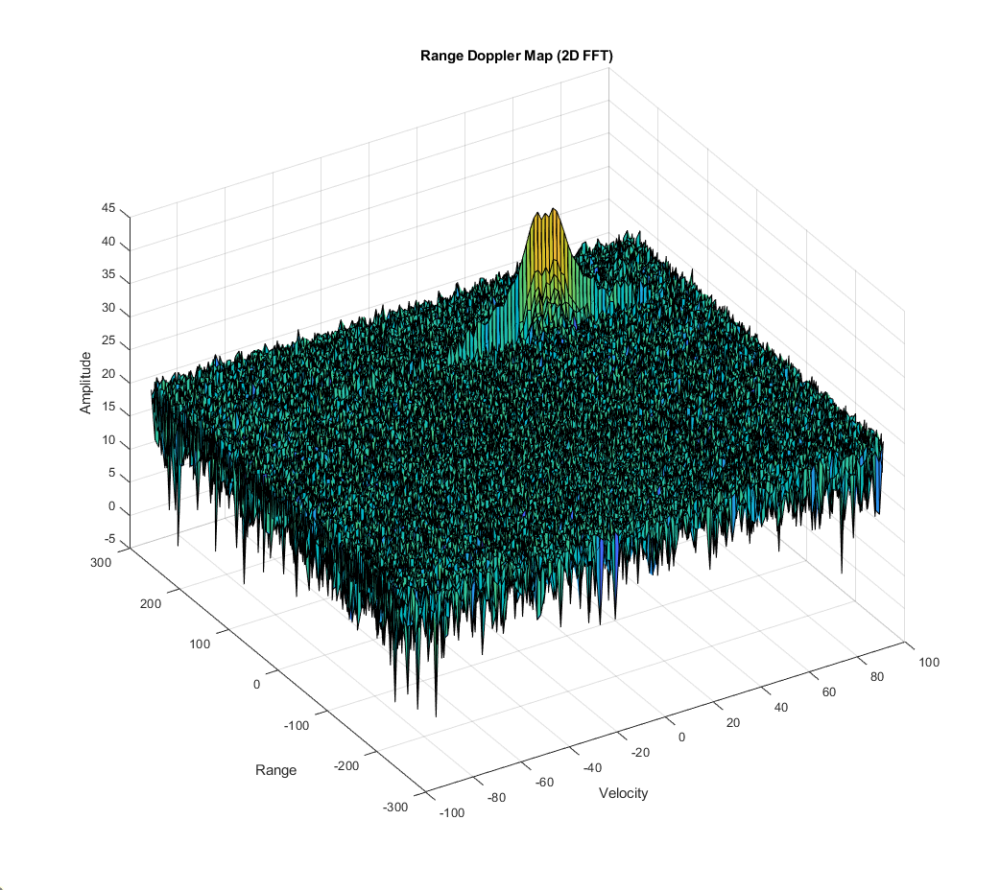
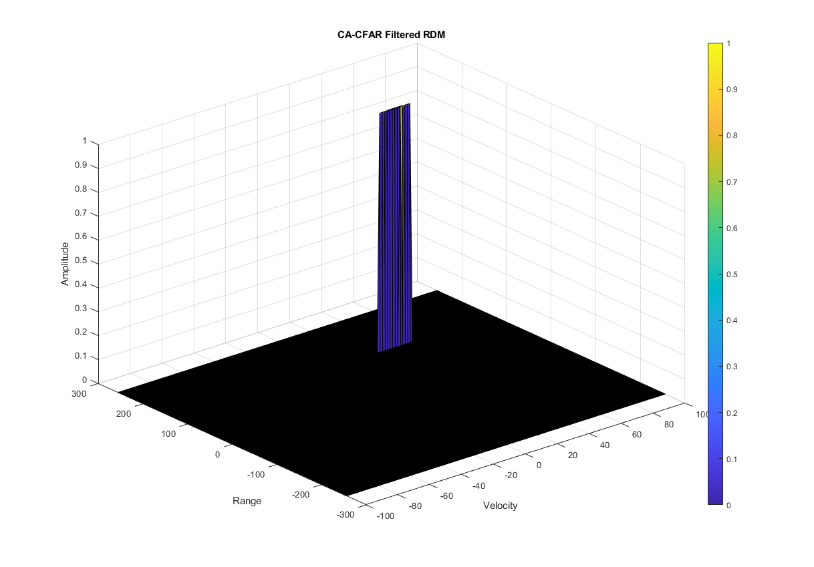

# **SFND Radar Target Generation and Detection**
Implementation of Radar target generation and detection using 2D FFT to form Range Doppler Map and 2D Cell Averaging - Constant False Alarm Rate (CA-CFAR) technique for noise supression.

## Project Layout


* Configure the FMCW waveform based on the system requirements.
* Define the range and velocity of target and simulate its displacement.
* For the same simulation loop process the transmit and receive signal to determine the beat signal
* Perform Range FFT on the received signal to determine the Range
* Towards the end, perform the CFAR processing on the output of 2nd FFT to display the target.

## Rubrics
Note: 2D CA-CFAR implementation is in the `Radar_Target_Generation_and Detection.m` file and the line numbers discussed belowe refer to this file.

### 1. FMCW Waveform Design
```
With the given Radar Specifications as below,

-> Frequency of operation = 77GHz
-> Max Range = 200m
-> Range Resolution = 1 m
-> Max Velocity = 100 m/s
-> Speed of light = 3e8 m/se

Bandwidth (Bsweep), chirp time (Tchirp) and slope are calculated on line 34, 35, 36.
```
The formulas for the above are as follows:
* Bandwidth   = speed of light / (2 * Range Resolution)        = 150 *10^6 Hz
* chirp time  = (sweep time factor*2*Max Range)/speed of light = 7.33 *10^-6 sec
* slope       = Bandwidth / chirp time                         = 2.0455 * 10^13

### 2. Simulation Loop

In this section `line 66-83` we generate the signal and simulate the moving target. The target's initial position and target velocity are set as 130 meters and 40 m/s respectively. We initialize a discrete time vector of length (#of chirps in one sequence * #samples on each chirp). The Transmitting (Tx) and Receiving (Rx) signal are initialzed to the same length and are calculated for each time step in a for loop. The beat signal is calculated by multiplying the Transmit signal with Receive signal. This process in turn works as frequency subtraction. It is implemented by element by element multiplication of transmit and receive signal matrices.

### 3. Range FFT (1st FFT)

We use the `fft()` function in MATLAB to produce the 1D FFT of the beat signal on the range dimention. We further normalize, take the absoulte value and the one-sided signal of the 1D FFT output. The output of the 1D FFT is as shown below, which shows a peak correctly at 130 meters (+/- 10 meters) which is the target's initial position.



### 4. Doppler FFT (2nd FFT)

Once the range bins are determined by running range FFT across all the chirps, a second FFT is implemented along the second dimension to determine the doppler frequency shift. As discussed, the doppler is estimated by processing the rate of change of phase across multiple chirps. Hence, the doppler FFT is implemented after all the chirps in the segment are sent and range FFTs are run on them.

The output of the first FFT gives the beat frequency, amplitude, and phase for each target. This phase varies as we move from one chirp to another (one bin to another on each row) due to the target’s small displacements. Once the second FFT is implemented it determines the rate of change of phase, which is nothing but the doppler frequency shift.

The output of Range Doppler response represents an image with Range on one axis and Doppler on the other. This image is called as Range Doppler Map (RDM). These maps are often used as user interface to understand the perception of the targets as shown below.



### 5. 2D CA-CFAR

The steps for the 2D CA-CFAR is as follows:
* Determine the number of Training cells for each dimension. Similarly, pick the number of guard cells.
* Slide the cell under test (CUT) across the complete matrix. Make sure the CUT has margin for Training and Guard cells from the edges.
* For every iteration sum the signal level within all the training cells. To sum convert the value from logarithmic to linear using db2pow function.
* Average the summed values for all of the training cells used. After averaging convert it back to logarithmic using pow2db.
* Further add the offset to it to determine the threshold.
* Next, compare the signal under CUT against this threshold.
* If the CUT level > threshold assign it a value of 1, else equate it to 0.

The CA-CFAR process is somewhat like a 2D convolution over an image where the pixel value here represents the dynamic threshold at the particular range-doppler bin to filter out the false alarm. Therefore, planned to code using kernel and 2D convolution operation with the Range-Doppler Map (RDM). Check below for details. Training cells, guard cells and offset were chosen by tuning.

**Implementaion steps for 2D CA-CFAR:**
1. Convert RDM matrix which is in decibels to power. `[line 196]`
2. Form a kernel of required size with the help of the number of training  cells and guard cells in both the range and doppler dimension. All the training cells in this kernel are set to 1 while the guard cells and cell under test are set to 0. `[line 198,199]`
3. This kernel is convolved with the RDM and stored in `convRDM_ker` parameter. We use the `conv2(RDMpow, kernel, 'valid')` function. "Valid" parameter downsizes the reultant matrix as required. Kernel will be convolved within the RDM matrix border. After this, each element og the convolved matrix is divided by the number of training cells becuase this is a cell averaging CFAR. `[line 203]`
4. We add the offset value to each element after converting the power values to decibels. This is our dynamic threshold matrix. `[line 204]`
5. We extract a subset of the RDM matrix where the Cells under test were present. `[line 207]`
6. Now the RDM matrix elements are modified to 0 if they are below threshold and to 1 if they are above the threshold. The order of comparison is important here, first < and then >=. `[line 208,209]`
7. Now this modified RDM matrix is padded with zeros to match the size of the original RDM matrix, since the CUT cannot be located at the edges of the matrix. `[line 217]`

Below is the output of 2D CA-CFAR. We can see that it detects the range and velocity of the target accurately. 


